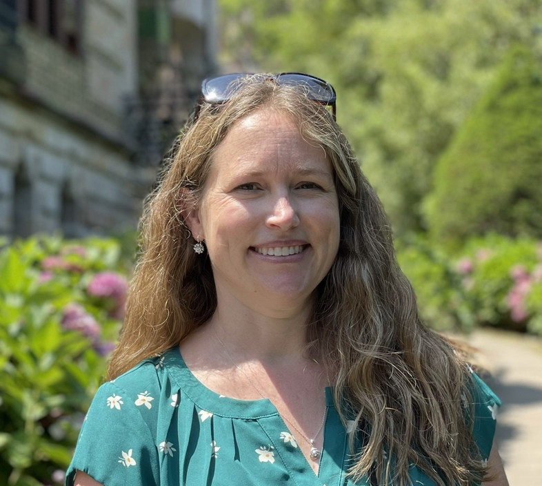

## Kate Hallock Guede

## About Me

I was born and raised in Southern California. I am a native English speaker and am fluent in Spanish.  I have my Master’s degree in Educational Technology. While I have focused on education for my first career, I am looking forward to pivoting towards technology and specifically full stack developing for my second career.  

I have completed the first third of the MIT xPRO Professional Certificate in Coding: Full Stack Development with MERN while aiming at proficiency in JavaScript, CSS and HTML.

## My GitHub

 My GitHub has several of the projects that I have worked on over the last ten weeks.   I would like to specifically showcase the three that are pinned to my page.

## Future Improvements

 I plan to continue to add to my repositories as my course continues.   My hope is to have a portfolio that showcases my best work for my future employers.

## License Information
Projects are licensed with the [MIT license](https://github.com/khallockguede/Live-Bus-Animation/blob/main/LICENSE).  
I used [Bootstrap](https://getbootstrap.com/) elements in the construction of my Homepage, Projects, and Bio & Contact pages.
